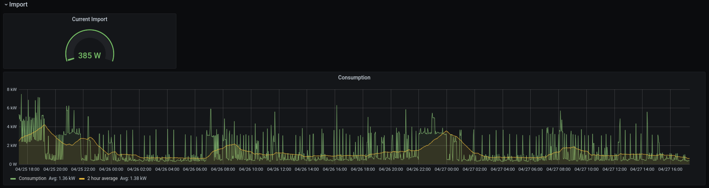

# smartmeter-grafana-dashboard

Self-contained Prometheus exporter, scraper and Grafana dashboard for Glowmarkt smartmeter data. 

An example to get you started importing smartmeter data from Glowmarkt into Prometheus and displaying it in Grafana. 

## Getting started

1. Install and set up an account on the Bright app from Glowmarkt. [Android](https://play.google.com/store/apps/details?id=uk.co.hildebrand.brightionic) / [iOS](https://itunes.apple.com/us/app/bright/id1369989022).
Note: seeing data in the app is a prerequisite. If you can't, you should check with Glowmarkt whether your smartmeter is compatible (SMETS2 or SMETS1 that have been DCC migrated). 
2. Create a `.env` from the `.env.example` with your credentials from Glowmarkt. Note. the `APP_ID` remains the same. 
3. [Install Docker Compose](https://docs.docker.com/compose/install/) (and Docker, if on Linux). 
4. Run `docker-compose up -d`. This may take a while to pull and build containers. 
5. Once running, visit `localhost:3000` and login with the default Grafana credentials (`admin` and `admin`). 
6. Add a new Prometheus datasource with URL `http://localhost:9000` and Access `Browser`. 
7. Import the `dashboard.json` and enjoy the metrics! 

## Help Wanted

I've only tested this with electricity (as I don't have a gas meter) and without the tariff data (as that is missing for me). PRs to incorperate that data would be appreciated. 

Equally, there is no cumulative data as I've found this quite difficult to calculate. PRs also appreciated for that. 

## Acknowledgements 

The Python scraper is heavily reliant on a library for the Glowmarkt API [available here](https://github.com/ghostseven/Hildebrand-Glow-Python-Library). It is redistributed with small changes. 